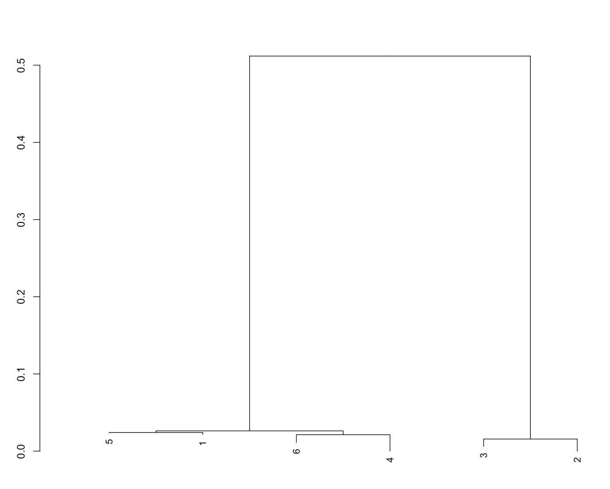

# phylogenetic-analysis
Metagenome assembly and phylogenetic tree analysis using R and MEGAHIT
# Metagenome Assembly and Phylogenetic Analysis

## Background
Next-generation sequencing (NGS) allows researchers to study viral genomes and understand their evolutionary relationships. By comparing genome sequences, phylogenetic trees can be constructed to determine how closely related different samples are.

Reference:
Holmes EC. 2009. The Evolution and Emergence of RNA Viruses. Oxford University Press.

---

## Purpose
The goal of this project was to assemble sequencing reads from six samples and determine their evolutionary relationships using a phylogenetic tree.

---

## Methods
Raw sequencing reads were assembled using MEGAHIT to generate contigs for each sample. The resulting contigs were imported into R and combined into a single dataset. Sequences longer than 5000 base pairs were selected for analysis.

The selected sequences were aligned using the AlignSeqs function from the DECIPHER package. The alignment was visualized using BrowseSeqs. A phylogenetic tree was constructed from the alignment using the Treeline function with the Maximum Likelihood (ML) method.

---

## Results
The phylogenetic tree shows that samples 1 and 5, 4 and 6, and 2 and 3 are closely related. Among these groups, samples 2 and 3 are the most distantly related from the others based on branch length in the tree.

The phylogenetic tree is shown below:

---

## Data and Files
All raw sequencing data and MEGAHIT assembly outputs are included in the repository as a compressed file (alex.zip & alex.zip 2) due to file size limitations.

The full alignment can be viewed in the HTML file:
final_project.html
